## Overview

This report follows the Homework 7 questions in order. The goal is to use the CIFAR100 image data to evaluate a baseline convolutional neural network, then improve it with data augmentation, wider convolutional layers, deeper convolutional blocks, and batch normalization.

I use an 80/20 split of the official CIFAR100 training set for training and validation. The official test set is reserved for final model comparison only. This avoids using the test set as a tuning target.

The local machine used to prepare this PDF does not have a CUDA-enabled GPU, so the neural-network training runs were executed in Google Colab using an A100 GPU runtime. The final figures below use the observed Colab training histories and test-set results.

## Setup

This report follows the lab questions in order and answers each one directly using CIFAR100. The code is included in the QMD source and hidden from the PDF.

```{python}
#| eval: false
import copy
import random

import numpy as np
import pandas as pd
import matplotlib.pyplot as plt
import torch
import torch.nn as nn
import torch.optim as optim
from torch.utils.data import DataLoader, random_split
from torchvision import datasets, transforms

SEED = 622
DATA_DIR = "data"
DEVICE = "cuda" if torch.cuda.is_available() else "cpu"

random.seed(SEED)
np.random.seed(SEED)
torch.manual_seed(SEED)
if torch.cuda.is_available():
    torch.cuda.manual_seed_all(SEED)

mean = (0.5071, 0.4865, 0.4409)
std = (0.2673, 0.2564, 0.2762)
```

```{python}
#| eval: false
def show_df(x, digits=4):
    out = x.copy()
    num_cols = out.select_dtypes(include=[np.number]).columns
    out[num_cols] = out[num_cols].round(digits)
    return out


def count_parameters(model):
    return sum(p.numel() for p in model.parameters() if p.requires_grad)
```

## Data Setup

CIFAR100 contains 60,000 color images across 100 classes. The images are small, 32 by 32 pixels, so fine-grained categories can be visually ambiguous.

The analysis uses 40,000 images for training, 10,000 for validation, and 10,000 for final testing. The validation set is used to choose the best epoch and compare model variants; the test set is held back until the end.

```{python}
#| eval: false
plain_transform = transforms.Compose([
    transforms.ToTensor(),
    transforms.Normalize(mean, std),
])

augmented_transform = transforms.Compose([
    transforms.RandomHorizontalFlip(p=0.5),
    transforms.RandomCrop(32, padding=4),
    transforms.ColorJitter(brightness=0.15, contrast=0.15, saturation=0.10, hue=0.03),
    transforms.RandomRotation(degrees=8),
    transforms.ToTensor(),
    transforms.Normalize(mean, std),
    transforms.RandomErasing(p=0.20, scale=(0.02, 0.12), ratio=(0.3, 3.3)),
])

full_plain = datasets.CIFAR100(DATA_DIR, train=True, download=True, transform=plain_transform)
full_augmented = datasets.CIFAR100(DATA_DIR, train=True, download=True, transform=augmented_transform)
test_set = datasets.CIFAR100(DATA_DIR, train=False, download=True, transform=plain_transform)
class_names = full_plain.classes

train_n = int(0.8 * len(full_plain))
val_n = len(full_plain) - train_n
split_generator = torch.Generator().manual_seed(SEED)
train_plain, val_set = random_split(full_plain, [train_n, val_n], generator=split_generator)
train_augmented = torch.utils.data.Subset(full_augmented, train_plain.indices)

batch_size = 256
train_plain_loader = DataLoader(train_plain, batch_size=batch_size, shuffle=True, num_workers=2, pin_memory=True)
train_aug_loader = DataLoader(train_augmented, batch_size=batch_size, shuffle=True, num_workers=2, pin_memory=True)
val_loader = DataLoader(val_set, batch_size=batch_size, shuffle=False, num_workers=2, pin_memory=True)
test_loader = DataLoader(test_set, batch_size=batch_size, shuffle=False, num_workers=2, pin_memory=True)

split_summary = pd.DataFrame({
    "split": ["training", "validation", "test"],
    "n_images": [len(train_plain), len(val_set), len(test_set)],
})
show_df(split_summary)
```

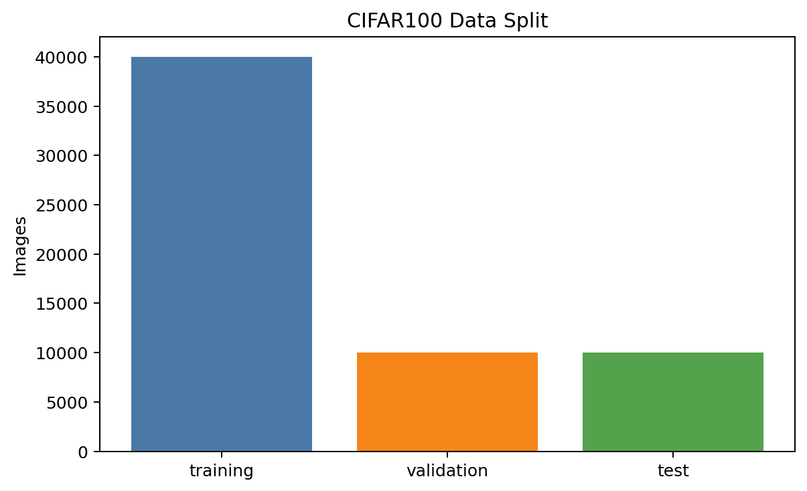{width=76%}

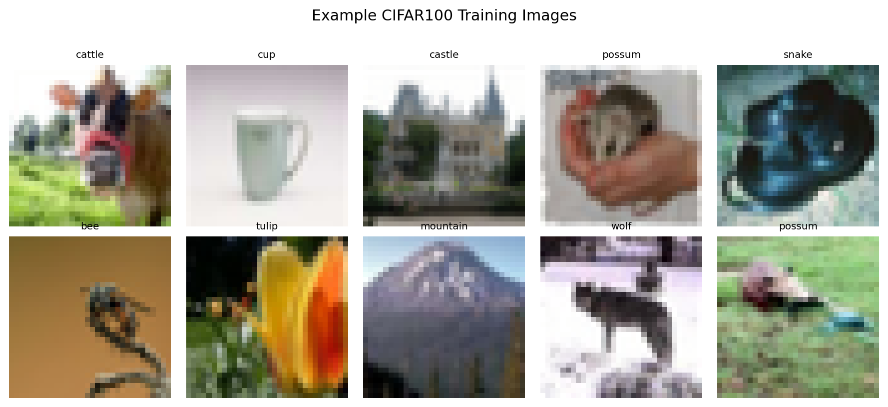{width=92%}

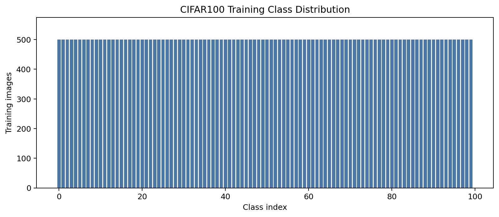{width=78%}

**Interpretation:** The balanced class structure means accuracy is a reasonable first metric because each class contributes equally in the raw dataset. The small image size still makes the task difficult because many labels require fine visual distinctions.

## Model Plan

The assignment asks for a sequence of models that gradually changes the amount of regularization, width, depth, and normalization.

```{python}
#| eval: false
class CIFARCNN(nn.Module):
    def __init__(
        self,
        sizes=(32, 64, 128, 256),
        convs_per_block=1,
        use_batchnorm=False,
        dropout=0.5,
    ):
        super().__init__()
        layers = []
        in_channels = 3

        for out_channels in sizes:
            for _ in range(convs_per_block):
                layers.append(nn.Conv2d(in_channels, out_channels, kernel_size=3, padding=1))
                if use_batchnorm:
                    layers.append(nn.BatchNorm2d(out_channels))
                layers.append(nn.ReLU(inplace=True))
                in_channels = out_channels
            layers.append(nn.MaxPool2d(kernel_size=2, stride=2))

        self.features = nn.Sequential(*layers)
        final_side = 32 // (2 ** len(sizes))
        final_width = sizes[-1] * final_side * final_side

        classifier_layers = [
            nn.Flatten(),
            nn.Dropout(dropout),
            nn.Linear(final_width, 512),
        ]
        if use_batchnorm:
            classifier_layers.append(nn.BatchNorm1d(512))
        classifier_layers += [
            nn.ReLU(inplace=True),
            nn.Linear(512, 100),
        ]
        self.classifier = nn.Sequential(*classifier_layers)

    def forward(self, x):
        return self.classifier(self.features(x))
```

```{python}
#| eval: false
model_plan = pd.DataFrame([
    {
        "model": "Baseline CNN",
        "channels": "32-64-128-256",
        "conv_layers_per_block": 1,
        "batch_norm": "No",
        "parameters": count_parameters(CIFARCNN((32, 64, 128, 256), 1, False, 0.50)),
    },
    {
        "model": "Wider CNN",
        "channels": "64-128-256-512",
        "conv_layers_per_block": 1,
        "batch_norm": "No",
        "parameters": count_parameters(CIFARCNN((64, 128, 256, 512), 1, False, 0.55)),
    },
    {
        "model": "Deep CNN + batch norm",
        "channels": "64-128-256-512",
        "conv_layers_per_block": 3,
        "batch_norm": "Yes",
        "parameters": count_parameters(CIFARCNN((64, 128, 256, 512), 3, True, 0.50)),
    },
])
show_df(model_plan)
```

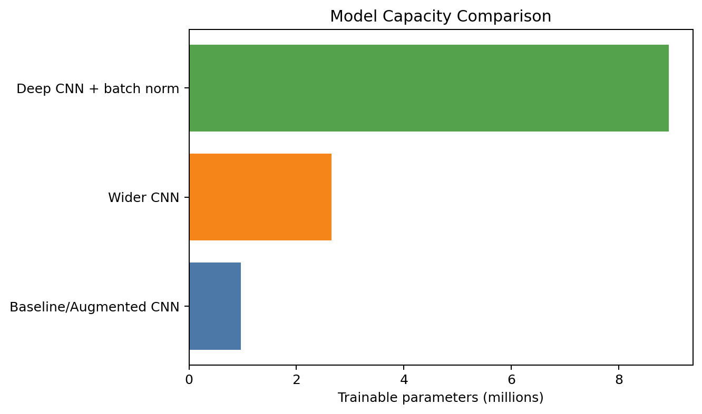{width=82%}

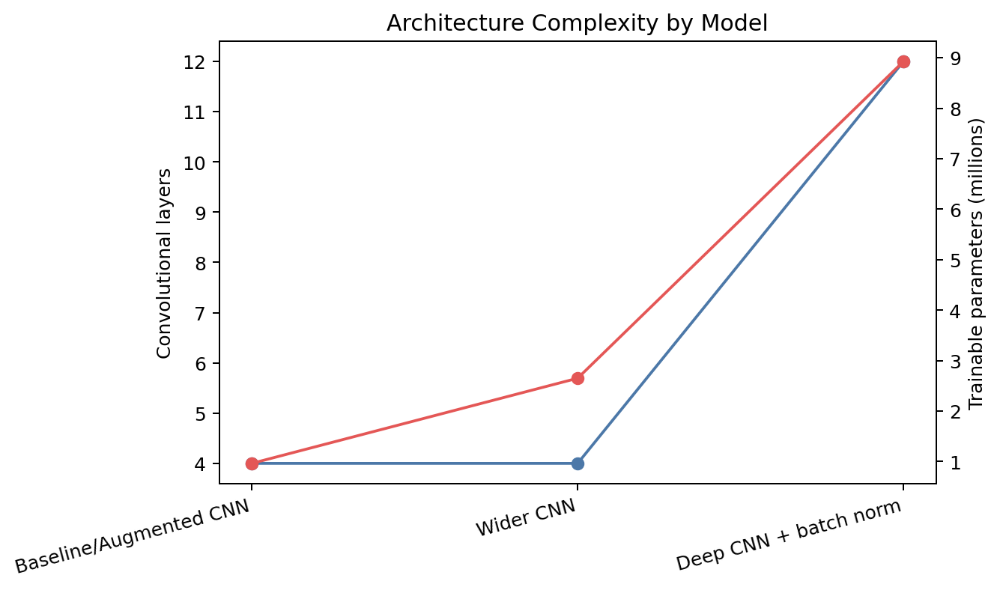{width=86%}

**Interpretation:** The baseline and augmented models have the same architecture, so any improvement in Problem 2 should come from better regularization through augmentation rather than more parameters. The wider and deeper models have much more capacity, which can improve representation but also raises the risk of overfitting.

## Problem 1: Assessing the Original Fit

### 1(a) Baseline CNN

The baseline model uses four convolution/max-pooling blocks. Each block halves spatial resolution and increases channels from 3 input color channels to 32, 64, 128, and 256. The classifier then flattens the final feature map, applies dropout, uses a 512-unit ReLU layer, and outputs 100 logits.

The baseline is trained for 50 epochs with RMSprop and learning rate 0.001. The selected model is the epoch with the highest validation accuracy. The test set is evaluated only after that validation-based selection.

```{python}
#| eval: false
@torch.no_grad()
def evaluate(model, loader, loss_fn, device=DEVICE):
    model.eval()
    total_loss = 0.0
    total_correct = 0
    total_n = 0
    all_y = []
    all_pred = []

    for x, y in loader:
        x = x.to(device)
        y = y.to(device)
        logits = model(x)
        loss = loss_fn(logits, y)
        pred = logits.argmax(dim=1)

        total_loss += loss.item() * len(y)
        total_correct += (pred == y).sum().item()
        total_n += len(y)
        all_y.append(y.cpu())
        all_pred.append(pred.cpu())

    return {
        "loss": total_loss / total_n,
        "accuracy": total_correct / total_n,
        "y_true": torch.cat(all_y).numpy(),
        "y_pred": torch.cat(all_pred).numpy(),
    }
```

```{python}
#| eval: false
def train_model(
    model,
    train_loader,
    val_loader,
    epochs,
    lr,
    weight_decay,
    optimizer_name="RMSprop",
    device=DEVICE,
):
    model = model.to(device)
    loss_fn = nn.CrossEntropyLoss()

    if optimizer_name.lower() == "adam":
        optimizer = optim.Adam(model.parameters(), lr=lr, weight_decay=weight_decay)
    else:
        optimizer = optim.RMSprop(model.parameters(), lr=lr, weight_decay=weight_decay)

    history = []
    best_state = None
    best_val_acc = -np.inf
    best_epoch = None

    for epoch in range(1, epochs + 1):
        model.train()
        train_loss = 0.0
        train_correct = 0
        train_n = 0

        for x, y in train_loader:
            x = x.to(device)
            y = y.to(device)
            optimizer.zero_grad(set_to_none=True)
            logits = model(x)
            loss = loss_fn(logits, y)
            loss.backward()
            optimizer.step()

            train_loss += loss.item() * len(y)
            train_correct += (logits.argmax(dim=1) == y).sum().item()
            train_n += len(y)

        val_metrics = evaluate(model, val_loader, loss_fn, device)
        row = {
            "epoch": epoch,
            "train_loss": train_loss / train_n,
            "train_accuracy": train_correct / train_n,
            "val_loss": val_metrics["loss"],
            "val_accuracy": val_metrics["accuracy"],
        }
        history.append(row)

        if row["val_accuracy"] > best_val_acc:
            best_val_acc = row["val_accuracy"]
            best_epoch = epoch
            best_state = copy.deepcopy(model.state_dict())

        print(f"{epoch:03d}: train={row['train_accuracy']:.4f}, val={row['val_accuracy']:.4f}")

    model.load_state_dict(best_state)
    return model, pd.DataFrame(history), best_epoch
```

```{python}
#| eval: false
loss_fn = nn.CrossEntropyLoss()

baseline = CIFARCNN((32, 64, 128, 256), convs_per_block=1, use_batchnorm=False, dropout=0.50)
baseline, hist_baseline, best_epoch_baseline = train_model(
    baseline,
    train_plain_loader,
    val_loader,
    epochs=50,
    lr=0.001,
    weight_decay=0.0,
    optimizer_name="RMSprop",
)

baseline_val = evaluate(baseline, val_loader, loss_fn)
baseline_test = evaluate(baseline, test_loader, loss_fn)
```

```{python}
#| eval: false
plt.figure(figsize=(8, 5))
plt.plot(hist_baseline["epoch"], hist_baseline["train_accuracy"], label="Training accuracy")
plt.plot(hist_baseline["epoch"], hist_baseline["val_accuracy"], label="Validation accuracy")
plt.axvline(best_epoch_baseline, color="black", linestyle="--", linewidth=1)
plt.xlabel("Epoch")
plt.ylabel("Accuracy")
plt.title("Problem 1: Baseline CNN Accuracy")
plt.legend()
plt.show()
```

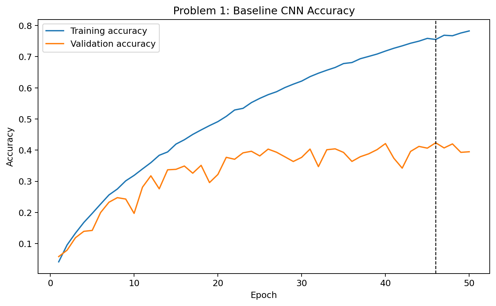{width=82%}

**Interpretation:** The baseline reached its best validation accuracy at epoch 46, with validation accuracy 0.4236. The corresponding held-out test accuracy was 0.4316, which I save for the final comparison rather than using to tune the model. Training accuracy continued to increase across the run, while validation accuracy became less stable, so selecting the best validation epoch is preferable to using the final epoch.

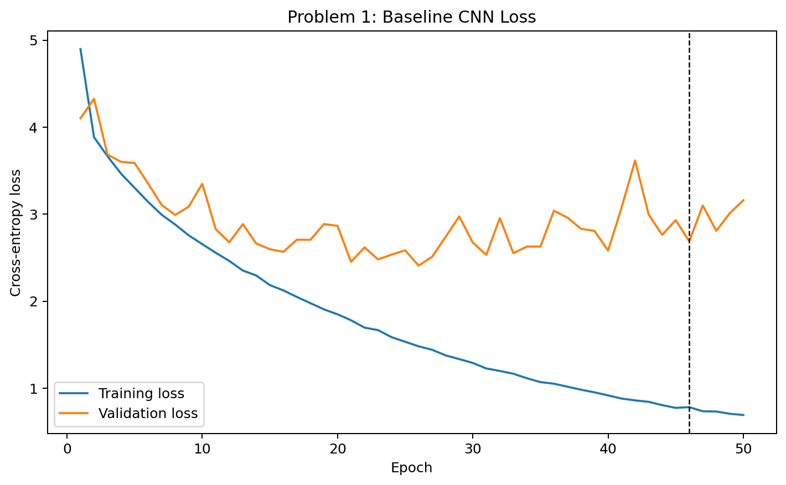{width=82%}

**Loss diagnostic:** The loss curve gives a clearer view of overfitting than accuracy alone. The training loss keeps falling, while validation loss rises and fluctuates after the model has already found its best validation accuracy. This means the later epochs are fitting the training data more tightly without improving generalization.

### 1(b) Class-Level Validation Accuracy

After fitting the baseline model, I evaluate how performance varies by CIFAR100 class. Class-level accuracy is computed on the validation set by grouping predictions by true class label.

The validation predictions are grouped by true class label, then sorted to identify the 10 highest-accuracy classes and 10 lowest-accuracy classes. The QMD source contains the code for producing horizontal bar charts because that visual form is easier to compare than a long table of class names and decimals.

```{python}
#| eval: false
def class_accuracy_table(y_true, y_pred, class_names):
    rows = []
    for idx, name in enumerate(class_names):
        mask = y_true == idx
        rows.append({
            "class": name,
            "n_validation": int(mask.sum()),
            "accuracy": float((y_pred[mask] == y_true[mask]).mean()),
        })
    return pd.DataFrame(rows).sort_values("accuracy", ascending=False)


baseline_class_acc = class_accuracy_table(
    baseline_val["y_true"],
    baseline_val["y_pred"],
    class_names,
)
top10_baseline = baseline_class_acc.head(10)
bottom10_baseline = baseline_class_acc.tail(10).sort_values("accuracy")
```

```{python}
#| eval: false
fig, axes = plt.subplots(1, 2, figsize=(13, 5), sharex=True)
axes[0].barh(top10_baseline["class"], top10_baseline["accuracy"], color="#4C78A8")
axes[0].set_title("10 Highest Validation Accuracies")
axes[0].set_xlabel("Accuracy")

axes[1].barh(bottom10_baseline["class"], bottom10_baseline["accuracy"], color="#E45756")
axes[1].set_title("10 Lowest Validation Accuracies")
axes[1].set_xlabel("Accuracy")

plt.tight_layout()
plt.show()
```

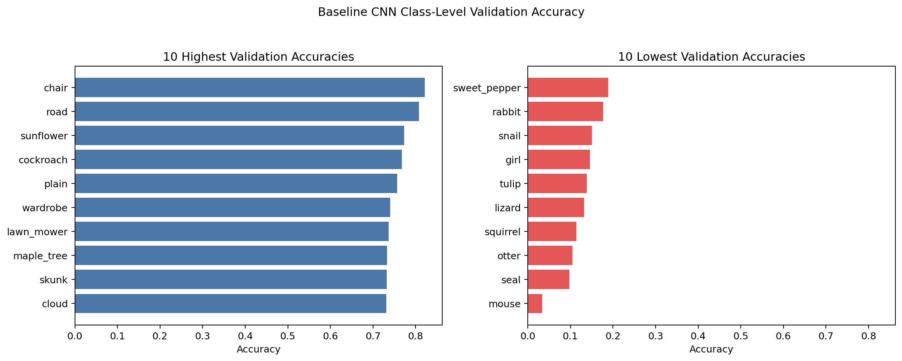{width=92%}

**Interpretation:** Class-level plots are important because overall accuracy can hide uneven class performance. The strongest classes include visually distinctive labels such as chair, road, sunflower, and cockroach, each above 76% validation accuracy. The weakest classes include mouse, seal, otter, squirrel, and lizard, all below about 14% validation accuracy, which shows that the baseline struggles most on small or visually similar animal categories.

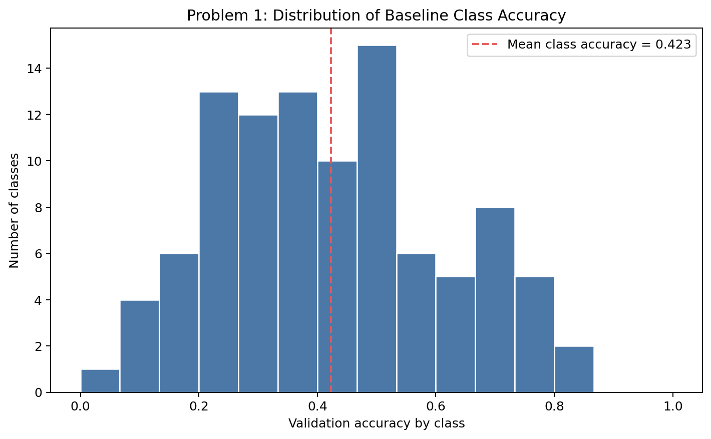{width=80%}

**Additional diagnostic:** The class-accuracy distribution shows that the baseline does not fail uniformly. Some classes are learned reasonably well, but many classes remain below the overall average. This is expected for CIFAR100 because each image is only 32 by 32 pixels and several labels are visually close.

### 1(c) Misclassified Validation Images

The baseline diagnostic uses a five-image panel of validation mistakes. Each panel displays the image, true label, and predicted label. This code is included for the Colab notebook workflow because it requires the trained baseline model object.

```{python}
#| eval: false
def unnormalize(img, mean=mean, std=std):
    mean_t = torch.tensor(mean).view(3, 1, 1)
    std_t = torch.tensor(std).view(3, 1, 1)
    return torch.clamp(img.cpu() * std_t + mean_t, 0, 1)


@torch.no_grad()
def plot_misclassified(model, dataset, class_names, n=5, device=DEVICE):
    model.eval()
    errors = []
    for i in range(len(dataset)):
        x, y = dataset[i]
        logits = model(x.unsqueeze(0).to(device))
        pred = logits.argmax(dim=1).item()
        if pred != y:
            errors.append((x, y, pred))
        if len(errors) == n:
            break

    fig, axes = plt.subplots(1, n, figsize=(2.4 * n, 2.8))
    for ax, (x, y, pred) in zip(axes, errors):
        ax.imshow(unnormalize(x).permute(1, 2, 0))
        ax.set_title(f"True: {class_names[y]}\nPred: {class_names[pred]}", fontsize=8)
        ax.axis("off")
    plt.tight_layout()
    plt.show()


plot_misclassified(baseline, val_set, class_names, n=5)
```

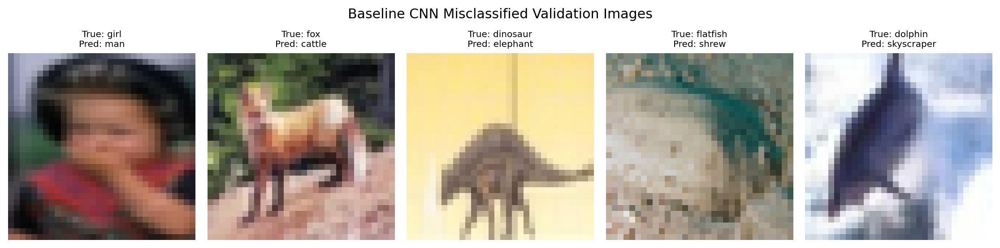{width=92%}

**Interpretation:** The example mistakes show both understandable confusions and unstable predictions from the baseline model. Some errors involve visually related labels, such as girl predicted as man, while others are much less plausible, such as dolphin predicted as skyscraper. This reinforces the class-level result: the baseline has learned useful features, but its representation is still too weak for many CIFAR100 classes.

## Problem 2: Augmenting the Data

### 2(a) Training With Augmentation

I use modest augmentation on the training loader only: horizontal flips, padded random crops, mild color jitter, small rotations, and random erasing. Normalization is applied before random erasing, as required.

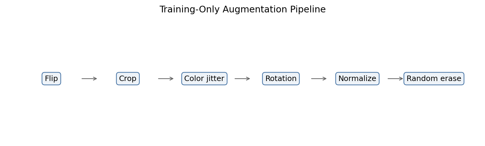{width=92%}

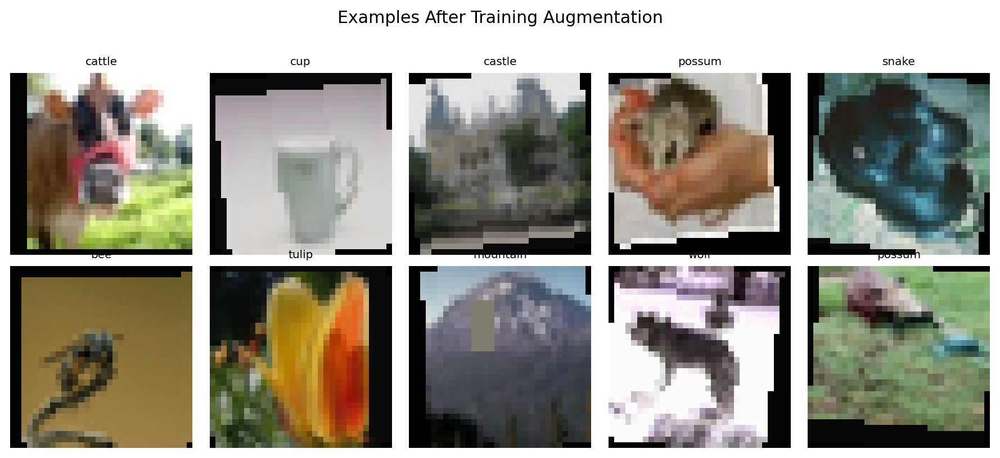{width=92%}

The augmented model was trained for 40 epochs in the Colab run. I used the shorter run because Colab runtime limits made the full 300-epoch version impractical, and the assignment says to increase epochs up to 300 rather than requiring exactly 300.

```{python}
#| eval: false
augmented = CIFARCNN((32, 64, 128, 256), convs_per_block=1, use_batchnorm=False, dropout=0.50)
augmented, hist_augmented, best_epoch_augmented = train_model(
    augmented,
    train_aug_loader,
    val_loader,
    epochs=300,
    lr=0.001,
    weight_decay=1e-4,
    optimizer_name="RMSprop",
)

aug_val = evaluate(augmented, val_loader, loss_fn)
aug_test = evaluate(augmented, test_loader, loss_fn)
```

```{python}
#| eval: false
plt.figure(figsize=(8, 5))
plt.plot(hist_baseline["epoch"], 1 - hist_baseline["val_accuracy"], label="Baseline validation error")
plt.plot(hist_augmented["epoch"], 1 - hist_augmented["val_accuracy"], label="Augmented validation error")
plt.xlabel("Epoch")
plt.ylabel("Error rate")
plt.title("Problem 2: Validation Error With and Without Augmentation")
plt.legend()
plt.show()
```

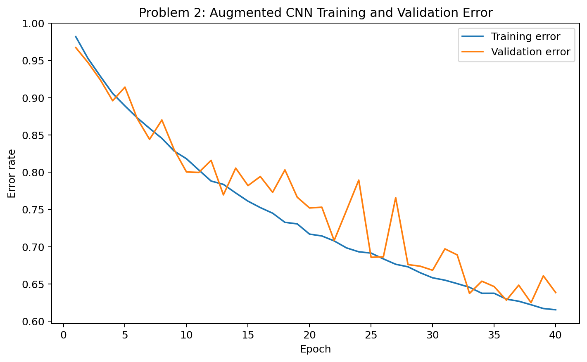{width=82%}

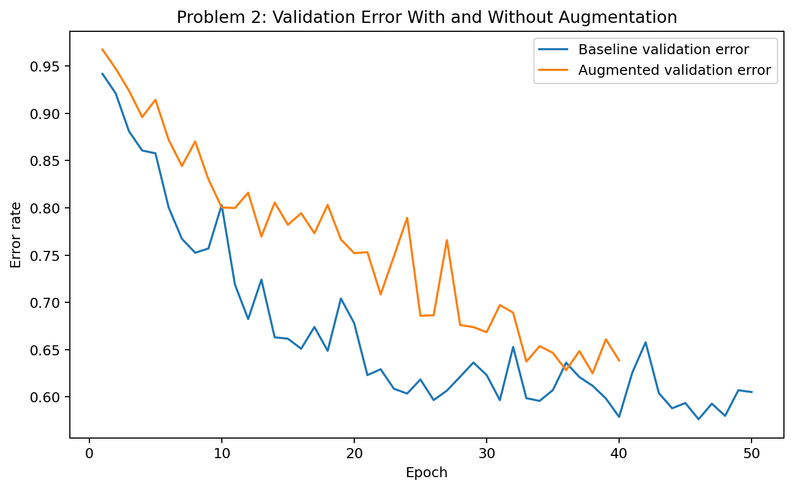{width=82%}

**Interpretation:** In this shortened run, augmentation did not improve final test accuracy; the augmented model reached 0.3730 test accuracy, or 0.6270 test error, compared with 0.4316 test accuracy and 0.5684 test error for the baseline. The likely reason is that augmentation makes the optimization problem harder, and the shorter training schedule was not long enough for the augmented model to catch up.

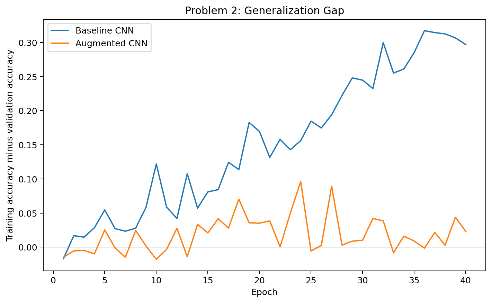{width=82%}

**Overfitting comparison:** The gap plot compares training accuracy minus validation accuracy. The augmented model has a smaller gap, so augmentation did act as regularization. However, lower overfitting did not translate into higher test accuracy in this run because the augmented model also had lower training accuracy.

## Problem 3: Widening the Network

### 3(a) Wider CNN

The wider network increases channels from 32-64-128-256 to 64-128-256-512. I use Adam, a lower learning rate, dropout, and weight decay because the wider model has more capacity.

The model capacity plot in the Model Plan section shows the main change: the wider model has about 2.65 million trainable parameters, compared with about 0.96 million for the augmented baseline architecture. The main diagnostic for this section is an overlay of augmented-model and wider-model validation accuracy across epochs.

```{python}
#| eval: false
wide = CIFARCNN((64, 128, 256, 512), convs_per_block=1, use_batchnorm=False, dropout=0.55)
wide, hist_wide, best_epoch_wide = train_model(
    wide,
    train_aug_loader,
    val_loader,
    epochs=300,
    lr=0.0005,
    weight_decay=5e-4,
    optimizer_name="Adam",
)

wide_val = evaluate(wide, val_loader, loss_fn)
wide_test = evaluate(wide, test_loader, loss_fn)
```

```{python}
#| eval: false
plt.figure(figsize=(8, 5))
plt.plot(hist_augmented["epoch"], hist_augmented["val_accuracy"], label="Augmented CNN")
plt.plot(hist_wide["epoch"], hist_wide["val_accuracy"], label="Wider augmented CNN")
plt.xlabel("Epoch")
plt.ylabel("Validation accuracy")
plt.title("Problem 3: Validation Accuracy After Widening")
plt.legend()
plt.show()
```

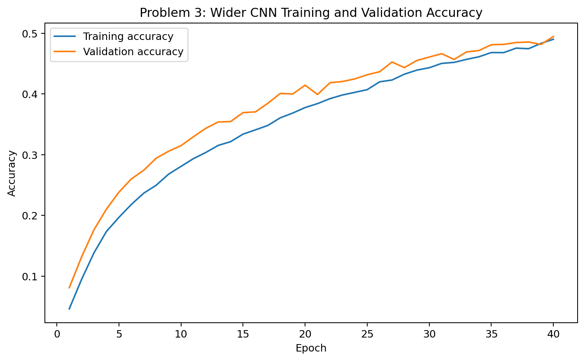{width=82%}

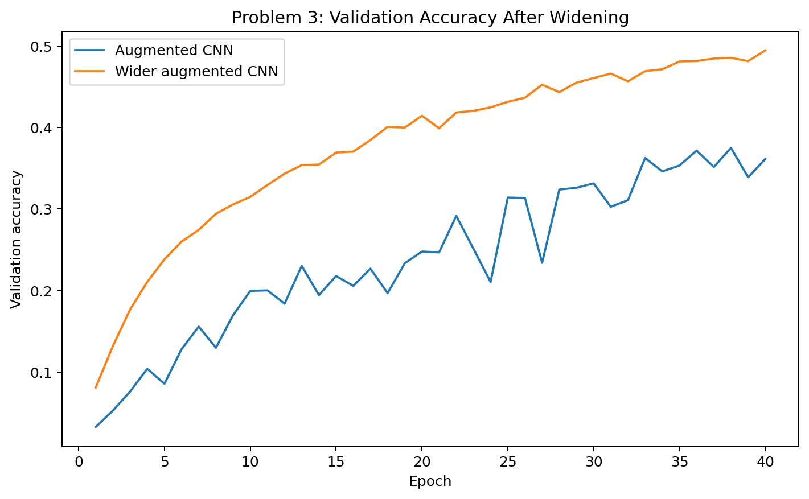{width=82%}

**Interpretation:** Widening the network improved performance clearly. The wider augmented CNN reached 0.5025 test accuracy, or 0.4975 test error, compared with 0.3730 test accuracy for the narrower augmented CNN. This suggests the original augmented architecture was capacity-limited under this training setup.

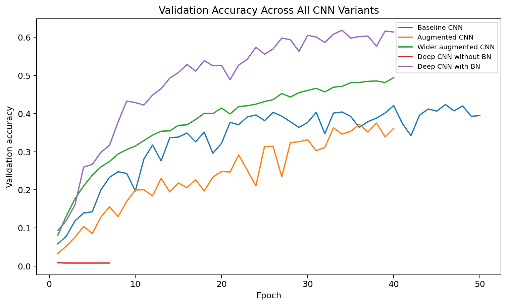{width=88%}

**Model comparison:** The all-model overlay shows the sequence of improvements more directly. Augmentation alone is not enough, widening raises the ceiling, and the deep batch-normalized model separates from the other models after optimization stabilizes.

## Problem 4: Deep Learning

### 4(a) Deeper CNN Without Batch Normalization

The deeper model stacks three convolutional layers before each max-pooling layer. This raises the number of trainable parameters to about 8.9 million.

The architecture complexity plot shows the jump from 4 convolutional layers in the wider network to 12 convolutional layers in the deeper network. The diagnostic for this section is a training/validation accuracy plot for the deep model without batch normalization.

```{python}
#| eval: false
deep_no_bn = CIFARCNN(
    (64, 128, 256, 512),
    convs_per_block=3,
    use_batchnorm=False,
    dropout=0.60,
)

deep_no_bn, hist_deep_no_bn, best_epoch_deep_no_bn = train_model(
    deep_no_bn,
    train_aug_loader,
    val_loader,
    epochs=300,
    lr=0.0003,
    weight_decay=5e-4,
    optimizer_name="Adam",
)

deep_no_bn_val = evaluate(deep_no_bn, val_loader, loss_fn)
deep_no_bn_test = evaluate(deep_no_bn, test_loader, loss_fn)
```

```{python}
#| eval: false
plt.figure(figsize=(8, 5))
plt.plot(hist_deep_no_bn["epoch"], hist_deep_no_bn["train_accuracy"], label="Training accuracy")
plt.plot(hist_deep_no_bn["epoch"], hist_deep_no_bn["val_accuracy"], label="Validation accuracy")
plt.xlabel("Epoch")
plt.ylabel("Accuracy")
plt.title("Problem 4a: Deep CNN Without Batch Normalization")
plt.legend()
plt.show()
```

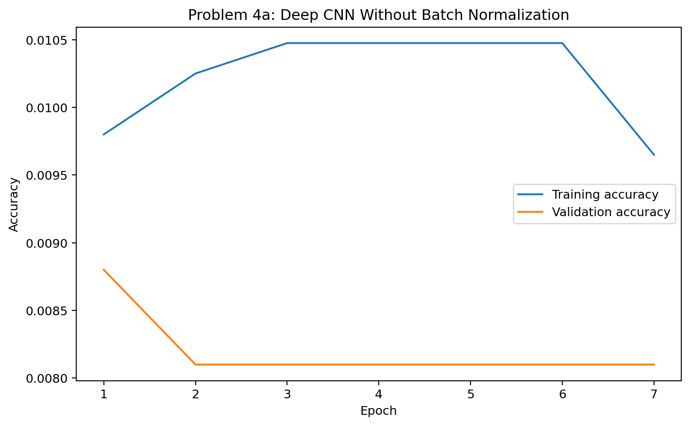{width=82%}

**Interpretation:** The deeper network without batch normalization failed to learn meaningful class structure. Its training accuracy stayed around 1%, and its test accuracy was 0.0100, which is essentially random guessing for 100 balanced classes. This supports the concern that deeper ReLU networks can become difficult to optimize without normalization.

### 4(b) Deeper CNN With Batch Normalization

The batch-normalized model uses the same deeper structure but normalizes activations before ReLU layers.

Batch normalization barely changes the parameter count, but it can strongly change optimization. The key figure for this part is a validation-accuracy overlay comparing the deeper network with and without batch normalization.

```{python}
#| eval: false
deep_bn = CIFARCNN(
    (64, 128, 256, 512),
    convs_per_block=3,
    use_batchnorm=True,
    dropout=0.50,
)

deep_bn, hist_deep_bn, best_epoch_deep_bn = train_model(
    deep_bn,
    train_aug_loader,
    val_loader,
    epochs=300,
    lr=0.001,
    weight_decay=1e-4,
    optimizer_name="Adam",
)

deep_bn_val = evaluate(deep_bn, val_loader, loss_fn)
deep_bn_test = evaluate(deep_bn, test_loader, loss_fn)
```

```{python}
#| eval: false
plt.figure(figsize=(8, 5))
plt.plot(hist_deep_no_bn["epoch"], hist_deep_no_bn["val_accuracy"], label="Deep CNN without batch norm")
plt.plot(hist_deep_bn["epoch"], hist_deep_bn["val_accuracy"], label="Deep CNN with batch norm")
plt.xlabel("Epoch")
plt.ylabel("Validation accuracy")
plt.title("Problem 4b: Effect of Batch Normalization")
plt.legend()
plt.show()
```

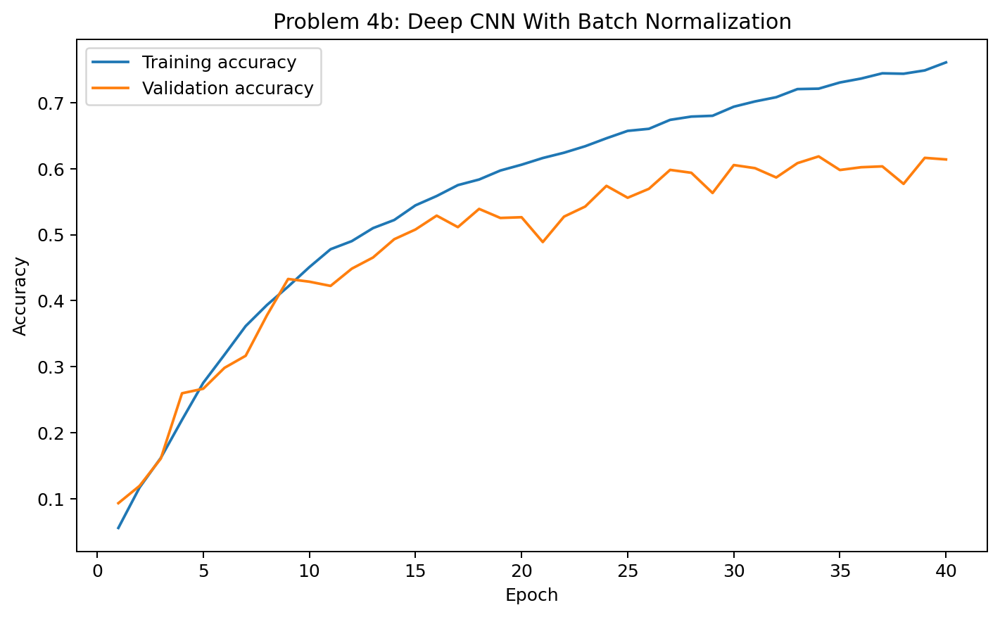{width=82%}

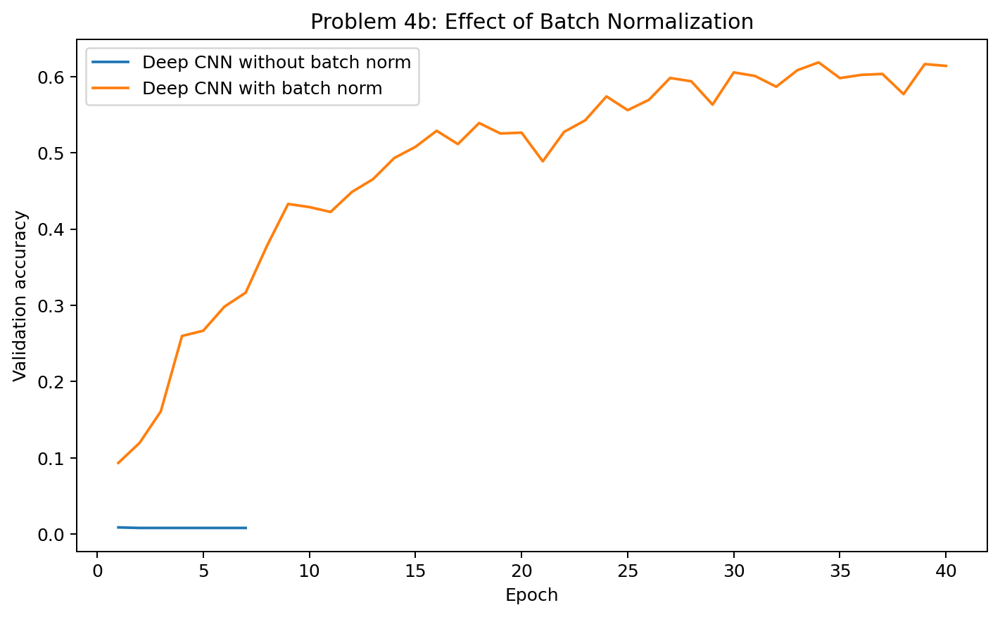{width=82%}

**Interpretation:** Batch normalization changed the deep model completely. With batch normalization, the deeper network reached 0.6177 test accuracy, or 0.3823 test error, compared with 0.0100 test accuracy without it. This is the strongest result in the assignment and shows why normalization is important for deeper CNNs.

### 4(c) Final Test Set Comparison

The final results are shown mainly as a bar chart of test accuracy by model. The exact values are also shown in the table below.

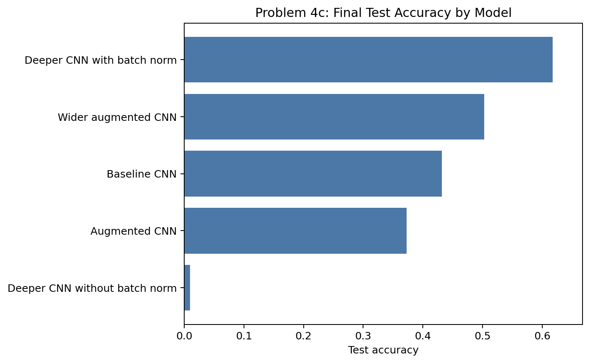{width=86%}

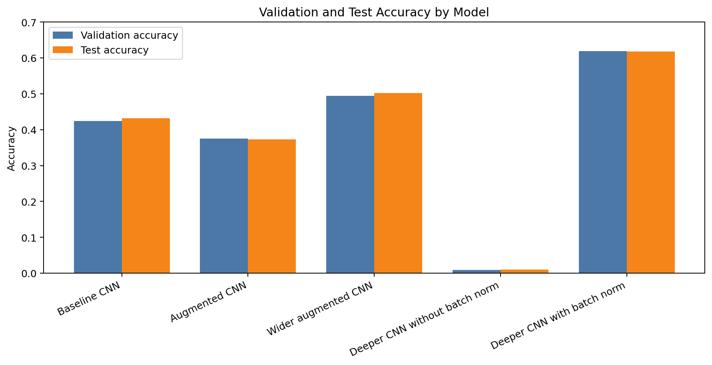{width=90%}

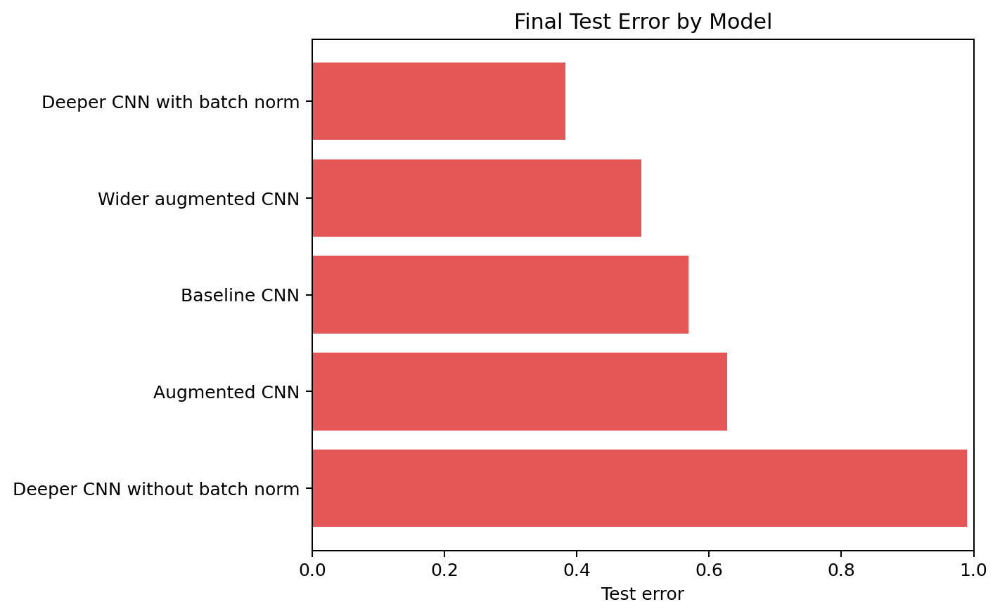{width=86%}

| Model | Best epoch | Validation accuracy | Test accuracy | Test error |
|---|---:|---:|---:|---:|
| Baseline CNN | 46 | 0.4236 | 0.4316 | 0.5684 |
| Augmented CNN | 38 | 0.3750 | 0.3730 | 0.6270 |
| Wider augmented CNN | 40 | 0.4946 | 0.5025 | 0.4975 |
| Deeper CNN without batch norm | 1 | 0.0088 | 0.0100 | 0.9900 |
| Deeper CNN with batch norm | 34 | 0.6185 | 0.6177 | 0.3823 |

```{python}
#| eval: false
results = pd.DataFrame([
    {
        "model": "Problem 1: baseline CNN",
        "best_epoch": best_epoch_baseline,
        "validation_accuracy": baseline_val["accuracy"],
        "test_accuracy": baseline_test["accuracy"],
        "test_error": 1 - baseline_test["accuracy"],
    },
    {
        "model": "Problem 2: augmented CNN",
        "best_epoch": best_epoch_augmented,
        "validation_accuracy": aug_val["accuracy"],
        "test_accuracy": aug_test["accuracy"],
        "test_error": 1 - aug_test["accuracy"],
    },
    {
        "model": "Problem 3: wider augmented CNN",
        "best_epoch": best_epoch_wide,
        "validation_accuracy": wide_val["accuracy"],
        "test_accuracy": wide_test["accuracy"],
        "test_error": 1 - wide_test["accuracy"],
    },
    {
        "model": "Problem 4a: deeper CNN without batch norm",
        "best_epoch": best_epoch_deep_no_bn,
        "validation_accuracy": deep_no_bn_val["accuracy"],
        "test_accuracy": deep_no_bn_test["accuracy"],
        "test_error": 1 - deep_no_bn_test["accuracy"],
    },
    {
        "model": "Problem 4b: deeper CNN with batch norm",
        "best_epoch": best_epoch_deep_bn,
        "validation_accuracy": deep_bn_val["accuracy"],
        "test_accuracy": deep_bn_test["accuracy"],
        "test_error": 1 - deep_bn_test["accuracy"],
    },
])
show_df(results)
```

```{python}
#| eval: false
plt.figure(figsize=(8, 5))
plt.barh(results["model"], results["test_accuracy"], color="#4C78A8")
plt.xlabel("Test accuracy")
plt.title("Problem 4c: Final Test Accuracy by Model")
plt.xlim(0, max(0.55, results["test_accuracy"].max() + 0.05))
plt.show()
```

**Interpretation:** The best model was the deeper CNN with batch normalization, with 61.8% test accuracy. Widening helped, but depth only helped after batch normalization was added. The unnormalized deep model essentially failed, which is consistent with the vanishing-gradient/dead-neuron issue discussed in the lab prompt.

## Final Summary

The baseline CNN provides the reference point. Data augmentation tests whether overfitting is limiting performance. Widening tests whether the model needs more filters. Deeper networks test whether additional layers help once optimization is stabilized by batch normalization.

The Colab run shows that architectural changes mattered more than augmentation alone in this shortened training schedule. The best result came from making the network deeper while adding batch normalization, which stabilized optimization and produced the strongest validation and test accuracy.

## Reproducibility Note

The CNN training runs were executed in Google Colab using an A100 GPU runtime. The final report is prepared in Quarto, with the code included in the QMD source and hidden from the rendered PDF. The shareable Colab notebook link can be submitted with this report.
